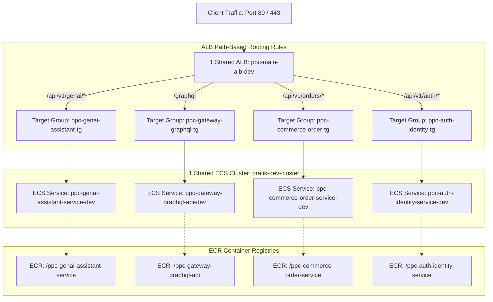

# 🏛️ Domain-Driven Design (DDD) Architecture & Repository Standard

This document establishes the official **Domain-Driven Design (DDD) Naming, Repository Structure, and Infrastructure Alignment Standards** for all microservices in the `ppc-` ecosystem.

---

## 📌 1. Repository Naming Standard (`ppc-` Prefix)

As an individual software engineer (`PPC`), all microservice repositories follow a strict, standardized Bounded Context naming convention starting with `ppc-`:

$$\text{Format: } \mathbf{ppc\text{-}[domain]\text{-}[bounded-context]\text{-}[api-type/service]}$$

```
Example: ppc-genai-assistant-service
         │   │     │         │
         │   │     │         └── Service Type (service, graphql-api, worker, gateway)
         │   │     └──────────── Bounded Context (assistant)
         │   └────────────────── Business Domain (genai, commerce, auth, finance)
         └────────────────────── Personal Organization Prefix (ppc-)
```

---

## 🏷️ 2. Repository Naming Matrix by Application Type

### A. GenAI & LLM Applications
| Application Type | GitHub Repository Name | Description |
| :--- | :--- | :--- |
| **GenAI RAG Service** | `ppc-genai-knowledge-service` | Vector search & document retrieval REST API |
| **GenAI Chat Assistant** | `ppc-genai-assistant-service` | Conversational LLM agent service (Spring AI) |
| **GenAI Image Engine** | `ppc-genai-vision-service` | Multimodal & image generation service |

### B. REST API Microservices
| Application Type | GitHub Repository Name | Description |
| :--- | :--- | :--- |
| **User Identity** | `ppc-auth-identity-service` | User authentication & JWT issuer REST API |
| **Order Processing** | `ppc-commerce-order-service` | E-commerce order management REST API |
| **Payment Gateway** | `ppc-finance-payment-service` | Payment provider integration service |

### C. GraphQL API Microservices
| Application Type | GitHub Repository Name | Description |
| :--- | :--- | :--- |
| **GraphQL Gateway** | `ppc-gateway-graphql-api` | Federated GraphQL unified schema entrypoint |
| **Customer GraphQL** | `ppc-customer-profile-graphql` | GraphQL query/mutation API for user profiles |
| **Analytics GraphQL** | `ppc-analytics-metrics-graphql` | Real-time dashboard analytics GraphQL API |

### D. Event-Driven Background Workers
| Application Type | GitHub Repository Name | Description |
| :--- | :--- | :--- |
| **Email Worker** | `ppc-notification-email-worker` | SQS/Kafka consumer for sending emails |
| **Data Sync Worker** | `ppc-etl-sync-worker` | Batch ingestion and data processing worker |

---

## 🏛️ 3. Package Structure Pattern inside Spring Boot (Clean DDD Architecture)

Inside every Spring Boot microservice (REST, GraphQL, or GenAI), Java code follows **Clean Architecture / Hexagonal DDD Layers**:

```
com.ppc.[domain].[context]/
├── domain/                      # 1. Core Domain Layer (Pure Java, No Spring dependencies)
│   ├── model/                   # Domain Entities & Value Objects (e.g. ChatMessage.java)
│   ├── repository/              # Domain Repository Interfaces (e.g. ChatRepository.java)
│   └── service/                 # Core Business Rules & Domain Logic
│
├── application/                 # 2. Application Use Cases
│   ├── dto/                     # Request/Response Records & Payloads
│   └── service/                 # Orchestration Services & Prompt Workflows
│
├── infrastructure/              # 3. Infrastructure & External Adapters
│   ├── bedrock/                 # AWS Bedrock / Spring AI Integrations
│   ├── persistence/             # JPA/Hibernate/MongoDB Implementations
│   └── config/                  # Spring Beans & AWS Client Configuration
│
└── presentation/                # 4. Presentation & Entry Points
    ├── rest/                    # REST Controllers (@RestController)
    ├── graphql/                 # GraphQL Controllers (@Controller / @QueryMapping)
    └── worker/                  # Queue Listeners (@SqsListener / @KafkaListener)
```

---

## ☁️ 4. AWS Infrastructure Alignment (Shared ALB + Shared ECS Cluster)

To minimize AWS cloud costs while maintaining enterprise isolation, all `ppc-` repositories deploy into **1 Shared ECS Cluster** and route traffic through **1 Shared Application Load Balancer (ALB)** using Path-Based Listener Rules.



### Traceability Mapping Table:

| Component | Naming Rule | Example |
| :--- | :--- | :--- |
| **GitHub Repo** | `ppc-<domain>-<context>-<type>` | `ppc-genai-assistant-service` |
| **ECR Registry** | `ppc-<domain>-<context>-<type>` | `.../ppc-genai-assistant-service` |
| **ECS Task Family**| `ppc-<domain>-<context>-task-<env>` | `ppc-genai-assistant-task-dev` |
| **ECS Service** | `ppc-<domain>-<context>-service-<env>`| `ppc-genai-assistant-service-dev` |
| **ALB Target Group**| `ppc-<domain>-<context>-tg-<env>` | `ppc-genai-assistant-tg-dev` |
| **ALB Path Rule** | `/api/v1/<domain>/*` or `/graphql` | `/api/v1/genai/*` |

---

## 📋 5. Checklist for Creating a New `ppc-` Microservice

When starting any new repository in your ecosystem:

1. [ ] **Repository Creation**: Name repository using `ppc-[domain]-[context]-[type]`.
2. [ ] **Package Declaration**: Use base package `com.ppc.[domain].[context]`.
3. [ ] **Actuator Readiness**: Include `spring-boot-starter-actuator` and expose `/actuator/health`.
4. [ ] **Add Infrastructure Config**: Add `.iac/dev.json` and `.iac/task-definition-template.json` targeting `pratik-dev-cluster`.
5. [ ] **Add CI/CD Workflow**: Add `.github/workflows/deploy-to-ecs.yml` configured with repo name.
6. [ ] **Register ALB Path Rule**: Add path-based routing rule on `ppc-main-alb-dev` pointing to target group.
