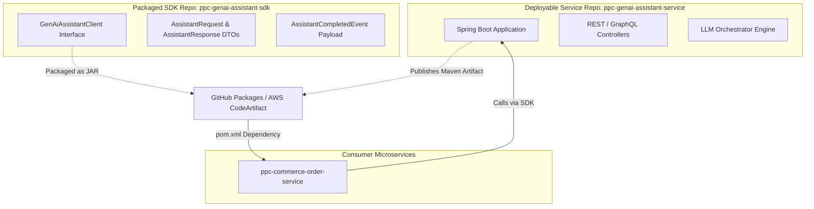
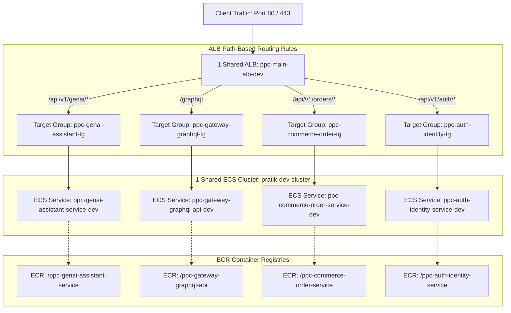

# 🏛️ Domain-Driven Design (DDD) Architecture & Repository Standard

This document establishes the official **Domain-Driven Design (DDD) Naming, Repository Structure, Domain SDK Publishing, and Infrastructure Alignment Standards** for all microservices and libraries in the `ppc-` ecosystem.

---

## 📌 1. Repository Naming Standard (`ppc-` Prefix)

All microservice repositories follow a strict, standardized Bounded Context naming convention starting with `ppc-`:

$$\text{Format: } \mathbf{ppc\text{-}[domain]\text{-}[bounded-context]\text{-}[type]}$$

```
Example 1 (Deployable Service): ppc-genai-assistant-service
                                │   │     │         │
                                │   │     │         └── Service Type (service, graphql-api, worker)
                                │   │     └──────────── Bounded Context (assistant)
                                │   └────────────────── Business Domain (genai, commerce, auth, finance)
                                └────────────────────── Personal Organization Prefix (ppc-)

Example 2 (Packaged SDK / Library): ppc-genai-assistant-sdk
                                    │   │     │         │
                                    │   │     │         └── Type (sdk, client, events)
                                    │   │     └──────────── Bounded Context (assistant)
                                    │   └────────────────── Business Domain (genai, commerce, auth)
                                    └────────────────────── Personal Organization Prefix (ppc-)
```

---

## 🏷️ 2. Repository Naming Matrix by Application Type

### A. Deployable Microservices (Deployed to AWS ECS / Docker)
| Category | GitHub Repository Name | Description | CI/CD Output |
| :--- | :--- | :--- | :--- |
| **GenAI App** | `ppc-genai-assistant-service` | Conversational LLM agent (Spring AI) | Docker Image -> AWS ECR -> ECS |
| **GenAI RAG** | `ppc-genai-knowledge-service` | Vector search & retrieval service | Docker Image -> AWS ECR -> ECS |
| **REST API** | `ppc-commerce-order-service` | E-commerce order processing API | Docker Image -> AWS ECR -> ECS |
| **GraphQL API**| `ppc-gateway-graphql-api` | Federated GraphQL schema gateway | Docker Image -> AWS ECR -> ECS |
| **Worker** | `ppc-notification-email-worker`| Async SQS queue processor worker | Docker Image -> AWS ECR -> ECS |

---

### B. Packaged Domain SDKs & Client Libraries (Published to Maven Registry, NOT deployed to ECS)
| Library Type | GitHub Repository Name | Purpose / Contents | CI/CD Output |
| :--- | :--- | :--- | :--- |
| **Domain SDK** | `ppc-genai-assistant-sdk` | Java Client SDK, WebClient Feign interfaces, DTOs | `.jar` -> GitHub Packages / CodeArtifact |
| **Domain SDK** | `ppc-commerce-order-sdk` | Order models, client interfaces, response payloads | `.jar` -> GitHub Packages / CodeArtifact |
| **Shared Events**| `ppc-common-domain-events` | Shared Domain Event schemas & Kafka/SQS payloads | `.jar` -> GitHub Packages / CodeArtifact |
| **Core Utilities**| `ppc-common-core-starter` | Shared Spring Boot starter for logging/security | `.jar` -> GitHub Packages / CodeArtifact |

---

## 📦 3. Domain SDK & Client Library Architecture Pattern

### Deployable Service vs. Packaged SDK Pattern



### SDK Key Architectural Guidelines:
1. **No Spring Boot Executable Plugin**: SDK projects configure `maven-jar-plugin` (standard reusable JAR), **NOT** `spring-boot-maven-plugin` (reusable library, not fat executable jar).
2. **Lightweight Dependencies**: SDKs contain zero infrastructure overhead (no heavy DB drivers or embedded servers).
3. **Consumption via Maven `pom.xml`**:
   ```xml
   <dependency>
       <groupId>com.ppc.genai</groupId>
       <artifactId>ppc-genai-assistant-sdk</artifactId>
       <version>1.0.0</version>
   </dependency>
   ```

---

## 🏛️ 4. Package Structure Pattern inside Spring Boot (Clean DDD Architecture)

Inside every deployable Spring Boot microservice, Java code follows **Clean Architecture / Hexagonal DDD Layers**:

```
com.ppc.[domain].[context]/
├── domain/                      # 1. Core Domain Layer (Pure Java, No Spring dependencies)
│   ├── model/                   # Domain Entities & Value Objects (e.g. ChatMessage.java)
│   ├── repository/              # Domain Repository Interfaces (e.g. ChatRepository.java)
│   └── service/                 # Core Business Rules & Domain Logic
│
├── application/                 # 2. Application Use Cases
│   ├── dto/                     # Request/Response Records & Payloads
│   └── service/                 # Orchestration Services & Prompt Workflows
│
├── infrastructure/              # 3. Infrastructure & External Adapters
│   ├── bedrock/                 # AWS Bedrock / Spring AI Integrations
│   ├── persistence/             # JPA/Hibernate/MongoDB Implementations
│   └── config/                  # Spring Beans & AWS Client Configuration
│
└── presentation/                # 4. Presentation & Entry Points
    ├── rest/                    # REST Controllers (@RestController)
    ├── graphql/                 # GraphQL Controllers (@Controller / @QueryMapping)
    └── worker/                  # Queue Listeners (@SqsListener / @KafkaListener)
```

---

## ☁️ 5. AWS Infrastructure Alignment (Shared ALB + Shared ECS Cluster)

To minimize AWS cloud costs while maintaining enterprise isolation, all deployable `ppc-` repositories deploy into **1 Shared ECS Cluster** and route traffic through **1 Shared Application Load Balancer (ALB)** using Path-Based Listener Rules.



### Traceability Mapping Table:

| Component | Naming Rule | Example |
| :--- | :--- | :--- |
| **Deployable Service Repo** | `ppc-<domain>-<context>-<type>` | `ppc-genai-assistant-service` |
| **Packaged SDK Repo** | `ppc-<domain>-<context>-sdk` | `ppc-genai-assistant-sdk` |
| **ECR Registry** | `ppc-<domain>-<context>-<type>` | `.../ppc-genai-assistant-service` |
| **ECS Task Family**| `ppc-<domain>-<context>-task-<env>` | `ppc-genai-assistant-task-dev` |
| **ECS Service** | `ppc-<domain>-<context>-service-<env>`| `ppc-genai-assistant-service-dev` |
| **ALB Target Group**| `ppc-<domain>-<context>-tg-<env>` | `ppc-genai-assistant-tg-dev` |

---

## 📋 6. Checklist for Creating a New `ppc-` Microservice or SDK

1. [ ] **Repository Type Determination**:
   - If **Deployable App**: Name `ppc-[domain]-[context]-[service/api/worker]`.
   - If **Packaged SDK/Library**: Name `ppc-[domain]-[context]-sdk` (Configured for Maven release publishing).
2. [ ] **Package Declaration**: Use base package `com.ppc.[domain].[context]`.
3. [ ] **Actuator Readiness (For Deployable Apps)**: Include `spring-boot-starter-actuator` and expose `/actuator/health`.
4. [ ] **CI/CD Pipeline Setup**:
   - For **Services**: `.github/workflows/deploy-to-ecs.yml` (Docker Build -> ECR -> ECS).
   - For **SDKs**: `.github/workflows/publish-sdk.yml` (Maven Build -> Publish `.jar` to GitHub Packages / AWS CodeArtifact).
