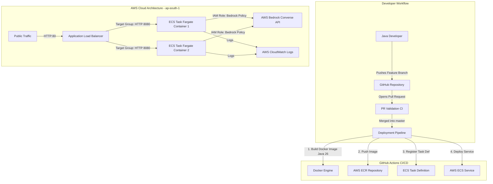
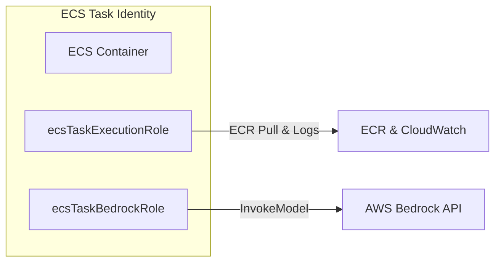

# 🛠️ Senior DevOps Engineer Guide: AWS ECS Fargate, ECR, ALB & CI/CD Architecture

This document serves as the authoritative operational and architectural handbook for managing the **Infrastructure, Containerization, IAM Security, and CI/CD Automation** for `springai-app`.

---

## 🏛️ System Architecture Overview



---

## 📦 1. Container Packaging & Docker Optimization

### Dockerfile Design Philosophy
The application uses a **Multi-Stage Dockerfile** targeting **Java 26** to enforce strict build isolation, minimize container image footprint, and optimize layer caching.

```dockerfile
# ----------------------------
# Stage 1: Build Stage
# ----------------------------
FROM maven:3.9.11-eclipse-temurin-26 AS builder

WORKDIR /app
COPY pom.xml .
COPY src ./src

RUN mvn clean package -DskipTests

# ----------------------------
# Stage 2: Runtime Stage (Minimal JRE)
# ----------------------------
FROM eclipse-temurin:26-jre

WORKDIR /app
COPY --from=builder /app/target/*.jar app.jar

EXPOSE 8080

ENTRYPOINT ["java","-jar","app.jar"]
```

### Senior DevOps Key Takeaways:
- **Build Isolation**: Source code and Maven compilation tools exist only in the `builder` stage, keeping final production runtime clean.
- **Base Image**: Uses `eclipse-temurin:26-jre` lightweight runtime image to eliminate unused JDK compilers and minimize vulnerability surface area.
- **Layer Caching**: Dependency declarations (`pom.xml`) are copied early to maximize Docker layer caching during local and CI build steps.

---

## 🏗️ 2. Infrastructure as Code (IaC) & AWS Resources

All environment configurations are versioned in the `.iac/` directory:

```
.iac/
├── dev.json                        # Development environment variable matrix
├── prod.json                       # Production environment variable matrix
├── task-definition-template.json   # ECS Task Definition JSON schema
└── alb-setup.tf                    # Terraform module for ALB & Security Groups
```

### Resource Specifications Matrix

| AWS Service | Resource Name / ID | Configuration / Specs |
| :--- | :--- | :--- |
| **AWS Region** | `ap-south-1` | Asia Pacific (Mumbai) |
| **ECR Registry** | `spring-app` | `012751250391.dkr.ecr.ap-south-1.amazonaws.com/spring-app` |
| **ECS Cluster** | `pratik-dev-cluster` | Fargate Serverless Compute |
| **ALB Security Group** | `springai-alb-sg` | Inbound: **HTTP (Port 80)** from `0.0.0.0/0` |
| **ECS Task Security Group**| `springai-ecs-task-sg` | Inbound: **TCP (Port 8080)** strictly from `springai-alb-sg` |
| **Target Group** | `springai-tg-dev` | Target Type: `IP`, Protocol: `HTTP 8080`, Health Check: `/actuator/health` |
| **Application Load Balancer**| `springai-alb-dev` | Internet-Facing, Public Subnets across 2 AZs |

---

## 🔐 3. IAM Least-Privilege Security & Bedrock Access

To ensure production security compliance (SAIF / CIS standards), we separate the **ECS Execution Role** from the **ECS Task Role**.



### A. ECS Task Execution Role (`ecsTaskExecutionRole`)
Grants the AWS ECS agent permissions to pull images from ECR and stream container logs to CloudWatch.
- **Attached AWS Managed Policy**: `arn:aws:iam::aws:policy/service-role/AmazonECSTaskExecutionRolePolicy`

### B. ECS Task Role (`ecsTaskBedrockRole`)
Grants the Spring AI application running inside Fargate direct, keyless authentication to AWS Bedrock models without embedding secret keys in code.

```json
{
  "Version": "2012-10-17",
  "Statement": [
    {
      "Effect": "Allow",
      "Action": [
        "bedrock:InvokeModel",
        "bedrock:InvokeModelWithResponseStream"
      ],
      "Resource": "*"
    }
  ]
}
```

---

## 🔄 4. CI/CD Pipeline & GitHub Branch Governance

The pipeline is implemented via **GitHub Actions** in [.github/workflows/deploy-to-ecs.yml](file:///c:/Users/Pratik/Downloads/springai-app/springai-app/.github/workflows/deploy-to-ecs.yml).

### Workflow Execution Strategy

```
                          ┌───────────────────────────┐
                          │   Git Push / Open PR      │
                          └─────────────┬─────────────┘
                                        │
                         ┌──────────────┴──────────────┐
                         ▼                             ▼
              [Pull Request to master]       [PR Merged to master]
                         │                             │
                         ▼                             ▼
              ┌─────────────────────┐      ┌─────────────────────────┐
              │ Job 1: Build & Test │      │ Job 1: Build & Test     │
              │ (No Deployment)     │      └────────────┬────────────┘
              └─────────────────────┘                   │
                                                        ▼
                                           ┌─────────────────────────┐
                                           │ Job 2: Deploy to ECS    │
                                           │ - Docker Build & Push   │
                                           │ - Update Task Definition│
                                           │ - Rolling ECS Deployment│
                                           └─────────────────────────┘
```

### GitHub Branch Protection Policies for `master`
1. Go to **Settings** > **Branches** > **Add rule**.
2. Branch Pattern: `master`
3. Enforce:
   - ✅ **Require a pull request before merging** *(Uncheck "Require approvals" for solo developers)*.
   - ✅ **Require status checks to pass before merging** (select `Build & Validate Code`).
   - ❌ **Uncheck "Include administrators"** (allows owner merge).

### GitHub Repository Secrets Required
- `AWS_ACCESS_KEY_ID`: IAM Deployer Access Key
- `AWS_SECRET_ACCESS_KEY`: IAM Deployer Secret Key

---

## 🚨 5. Operations, Health Checks & Troubleshooting Runbook

### Health Check Architecture
- **Endpoint**: `/actuator/health`
- **Port**: `8080`
- **Matcher**: `200 OK`
- **Interval**: `30 seconds` | **Unhealthy Threshold**: `3 consecutive failures`

### Operational Runbook Commands

#### 1. Check ECS Service Deployment Status
```powershell
aws ecs describe-services --cluster pratik-dev-cluster --services springai-app-service-dev --region ap-south-1
```

#### 2. View Live CloudWatch Logs
```powershell
aws logs tail "/ecs/springai-app-task-dev" --follow --region ap-south-1
```

#### 3. Force New Service Deployment (Manual Trigger)
```powershell
aws ecs update-service --cluster pratik-dev-cluster --service springai-app-service-dev --force-new-deployment --region ap-south-1
```

#### 4. Check Target Group Health Status
```powershell
aws elbv2 describe-target-health --target-group-arn <TARGET_GROUP_ARN> --region ap-south-1
```

---

## 📄 Summary Responsibility Matrix

| Domain | Scope | Owner |
| :--- | :--- | :--- |
| **App Code & Business Logic** | Java 26, Spring Boot Controllers, Prompts, DTOs | ☕ Java Developer |
| **Containerization** | Dockerfile, Base Images, Layer Optimization | ☁️ Senior DevOps Engineer |
| **Infrastructure (IaC)** | `.iac/` JSONs, ECR, ECS Fargate, ALB, SGs | ☁️ Senior DevOps Engineer |
| **Security & Access** | IAM Roles, Bedrock Least-Privilege Policies | ☁️ Senior DevOps Engineer |
| **Automation** | GitHub Actions Pipeline, Secrets & Branch Rules | ☁️ Senior DevOps Engineer |
